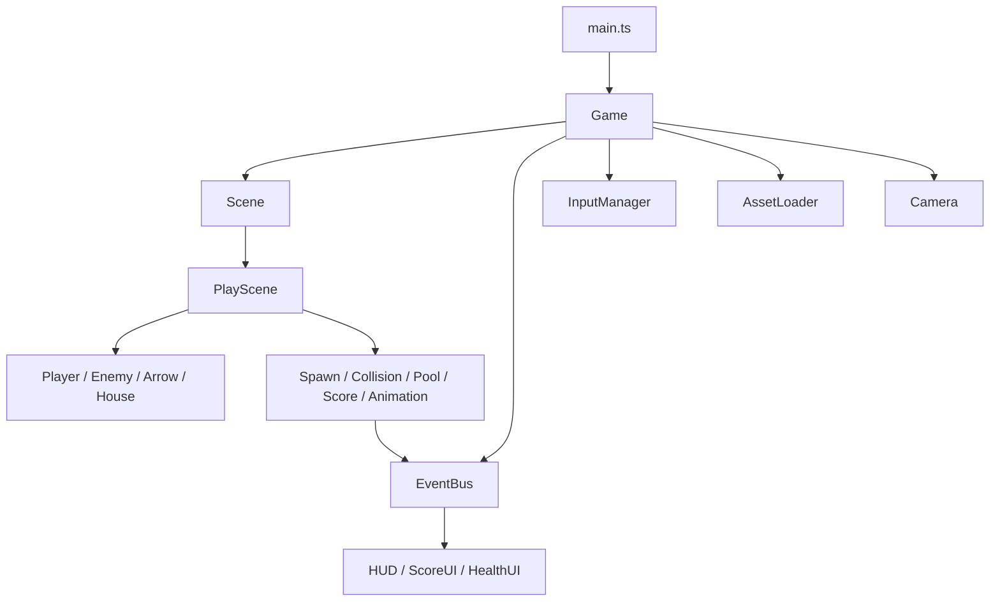
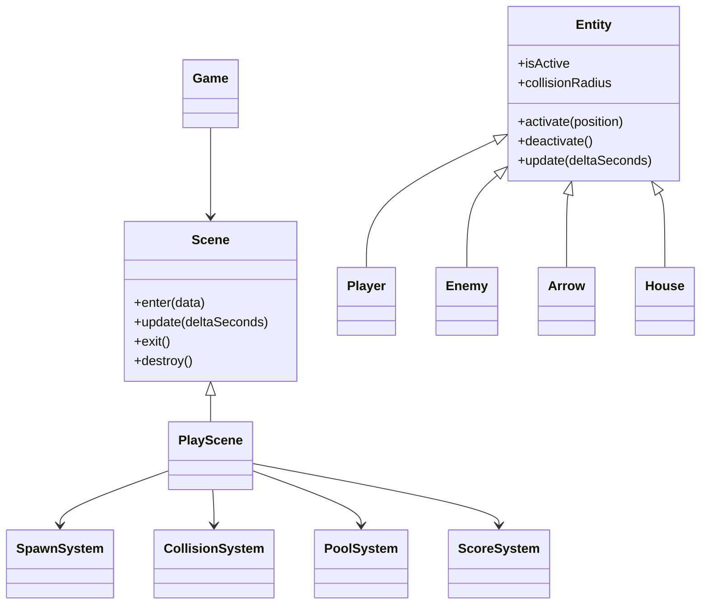
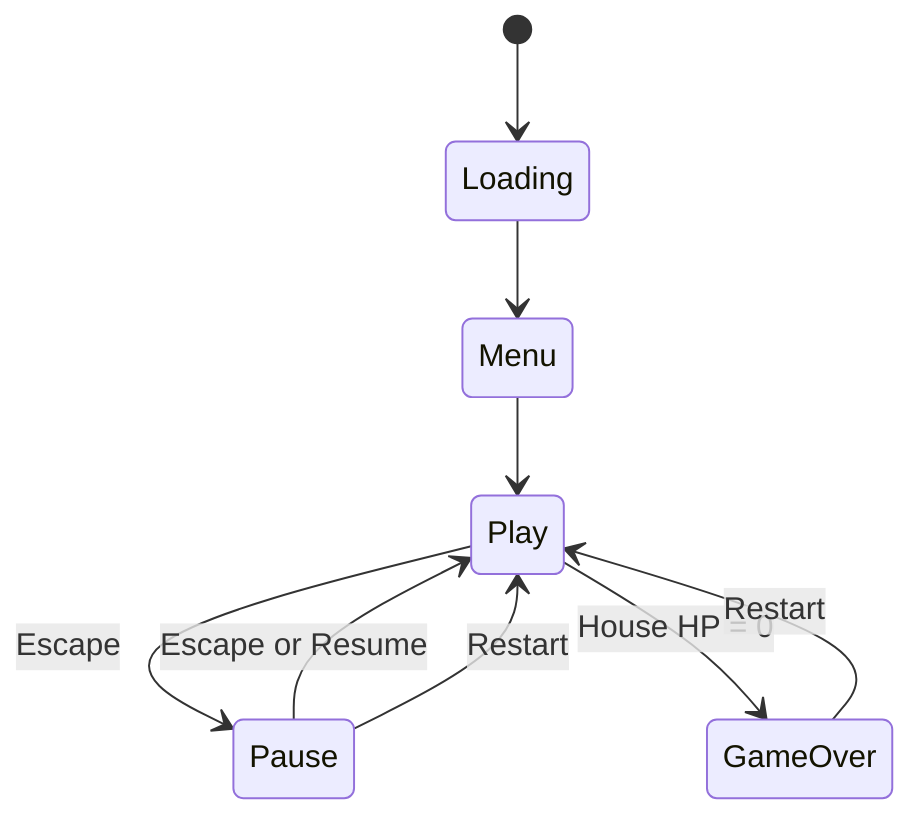
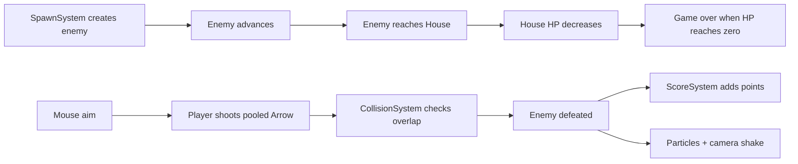

# Village Defender

Village Defender is a 2D survival defense game built with PixiJS v8, TypeScript, and Vite. The player protects a village house by aiming with the mouse and shooting enemies that advance from both sides of the screen.

This project is designed as a Game Web Intern portfolio piece. The focus is clean architecture, maintainable TypeScript, professional tooling, deployment readiness, and an implementation that is easy to explain during an interview.

## Features

- PixiJS v8 rendering with a TypeScript strict-mode codebase
- Scene management for loading, menu, gameplay, pause, and game over
- Event-driven communication between gameplay, UI, and core systems
- Object pooling for arrows and enemies
- Enemy spawning with gradual difficulty scaling
- Collision detection for arrows, enemies, and the village house
- Score and house HP HUD
- Camera shake, hit particles, enemy death effects, and arrow trails
- Project-local Vietnamese village placeholder PNG assets
- Restart and pause flow
- ESLint, Prettier, Vite production build, Docker, Nginx, and GitHub Actions

## Controls

| Input | Action |
| --- | --- |
| Mouse move | Aim |
| Left click | Shoot arrow |
| Escape | Pause or resume |
| R | Restart |

## Architecture

The project uses a small engine-style structure. `Game` owns PixiJS startup, scene transitions, input, and global services. Scenes compose entities and systems. Entities model objects in the world, while systems process rules such as spawning, collisions, scoring, pooling, and animations.



## Class Relationships



## Scene Flow



## Gameplay Flow



## Folder Structure

```text
src/
  assets/
  data/
    ApprovedAssetManifest.ts
    CharacterData.ts
    GameAssetData.ts
  core/
    AssetLoader.ts
    Camera.ts
    EventBus.ts
    Game.ts
    InputManager.ts
    Scene.ts
  entities/
    Arrow.ts
    Enemy.ts
    Entity.ts
    House.ts
    Player.ts
  scenes/
    GameOverScene.ts
    LoadingScene.ts
    MenuScene.ts
    CharacterSelectionScene.ts
    PauseScene.ts
    PlayScene.ts
  state/
    GameState.ts
  systems/
    AnimationSystem.ts
    CollisionSystem.ts
    PoolSystem.ts
    ScoreSystem.ts
    SpawnSystem.ts
  types/
    GameEvents.ts
    GameTypes.ts
    SceneServices.ts
  ui/
    Button.ts
    CharacterCard.ts
    HUD.ts
    HealthUI.ts
    ScoreUI.ts
  utils/
    Constants.ts
    Helpers.ts
    MathUtil.ts
    Random.ts
  main.ts
  styles.css
```

## Design Decisions

- Scene services are injected into scenes so scenes do not import or mutate the `Game` instance directly.
- The event bus is typed with `GameEventMap`, which keeps UI and gameplay communication explicit.
- Arrows and enemies use object pools to avoid repeated allocation during gameplay.
- Collision detection is a standalone system that returns collision results without mutating game state.
- `PlayScene` composes systems but delegates rules to smaller classes to avoid a god object.
- All tunable values live in `Constants.ts` so balancing does not require digging through logic.
- Docker uses a multi-stage build: Node creates static assets and Nginx serves the optimized output.
- Approved art paths are configured in data files and loaded optionally through `AssetLoader`, so development can continue before final PNGs are present.

## Installation

```bash
npm install
```

## Development

```bash
npm run dev
```

The Vite dev server runs on [http://localhost:5173](http://localhost:5173).

## Quality Checks

```bash
npm run typecheck
npm run lint
npm run build
```

## Docker Usage

Build and run the production container:

```bash
docker compose up --build
```

The container serves the game through Nginx at [http://localhost:8080](http://localhost:8080).

## Assets

Clean separated PNG assets should be placed under `public/assets`.

The loader will not request or render a texture until its path is added to `APPROVED_TEXTURE_PATHS` in `src/data/ApprovedAssetManifest.ts`. This prevents rejected extraction output or missing files from being used accidentally.

## Deployment

The project includes a GitHub Actions workflow that installs dependencies, runs ESLint, runs TypeScript checks, builds the project, and deploys the `dist` folder to GitHub Pages on push.

Manual deployment is also available:

```bash
npm run deploy
```

For GitHub Pages, set the repository Pages source to GitHub Actions.

## Screenshots

Add screenshots or GIFs here after publishing:

- Main menu
- Gameplay
- Pause overlay
- Game over screen

## Future Improvements

- Add sprite assets and a small texture atlas
- Add enemy variants with different speeds and health
- Add player upgrades or limited special arrows
- Add audio feedback and music controls
- Add unit tests for pure systems such as collision, spawning, and scoring
- Add mobile touch tuning and responsive HUD scaling
